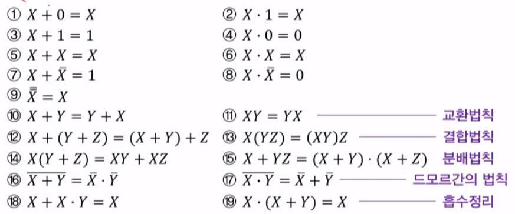

### 논리연산
- 논리연산과 논리집합
    + 집합이 0(거짓) 1(참)으로만 구성된 집합 {0,1}
- 논리연산(부울연산)
    + 두 개의 이산값에 적용되는 연산
- 논리집합{0,1}에 대한 세 가지 논리연산
    + AND연산: 점(.)으로 표시, 생략가능
    + OR 연산: 덧셈기호(+)로 표시
    + NOT연산: 변수 위에 줄(-)을 그어 표시
### 논리게이트
- AND, OR, NOT게이트
    + 1) AND 게이트(반달모양)
        * F = XY
    + 2) OR 게이트(뾰족한반달모양)
        * F = X + Y
    + 3) NOT 게이트(삼각형모양)
        * F = X바
- NAND, NOR 게이트 
    + 1) NAND게이트(AND하고 조그만 원)
        * F = XY바
    + 2) NOR게이트(OR하고 조그만 원)
        * F  = X + Y바
- XOR, XNOR 게이트
    + 1) XOR 게이트(OR게이트에 줄 두개)
        * F = X 동그라미더하기 Y
    + 2) XNOR 게이트(XOR게이트에 조그만 원)
        * F = X 동그라미더하기 Y 바
### 부울대수
    - 0과 1의 값을 갖는 논리변수와 논리연산을 다루는 대수 
### 부울함수 
    - 논리변수의 상호관계를 나타내기 위해 부울변수, 부울연산기호, 괄호 및 등호 등으로 나타내는 대수적 표현
### 부울함수와 진리표 
- 진리표    
    + 논리변수에 할당한 0과 1의 조합의 리스트
- 부울함수는 진리표로 나타낼 수 있다.

### 부울함수와 진리표와의 관계
- 부울 함수와 진리표와의 관계
    + 부울함수에 대한 진리표는 하나이다.
    + 그러나 동일 진리표를 만족하는 부울함수는 여러개가 될수있다
    + 따라서 동일 진리표에 대한 논리회로도는 여러개가 될수있다
    + 결론적으로 논리회로도는 단순해야 한다.
    + 따라서 부울함수의 단순화(간소화)가 필수

### 부울함수의 간소화 필요성
- 비용, 입력과 출력의 손실에 따라 효율성 극대화

### 부울함수의 간소화 방법
- 대수적인 방법
- 도표를 이용한 방법
- 테이블을 이용한 방법(입력변수가 많을 때 복잡하게)
---
### 대수적인 방법으로의 부울대수 간소화
- 기본 공식

    